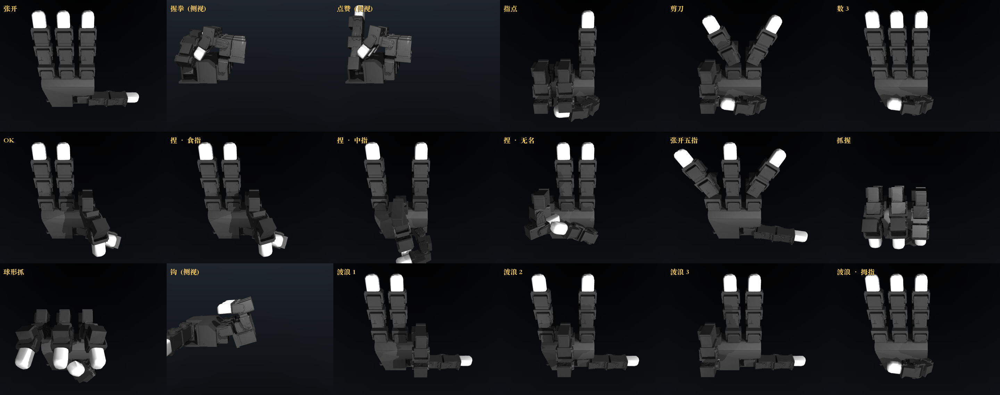
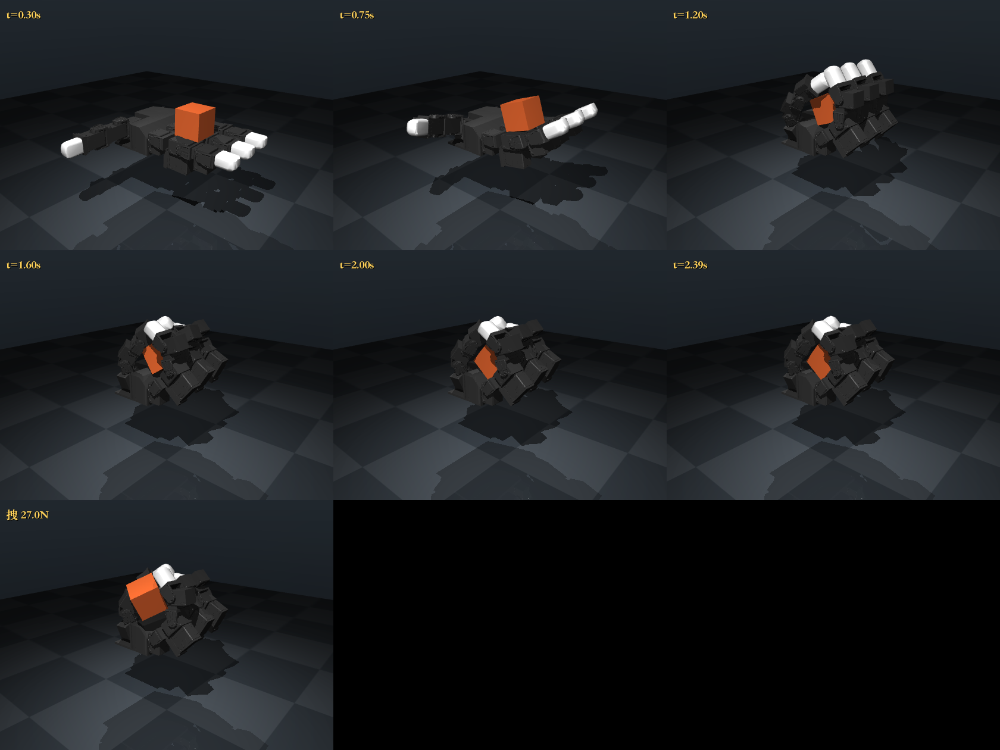
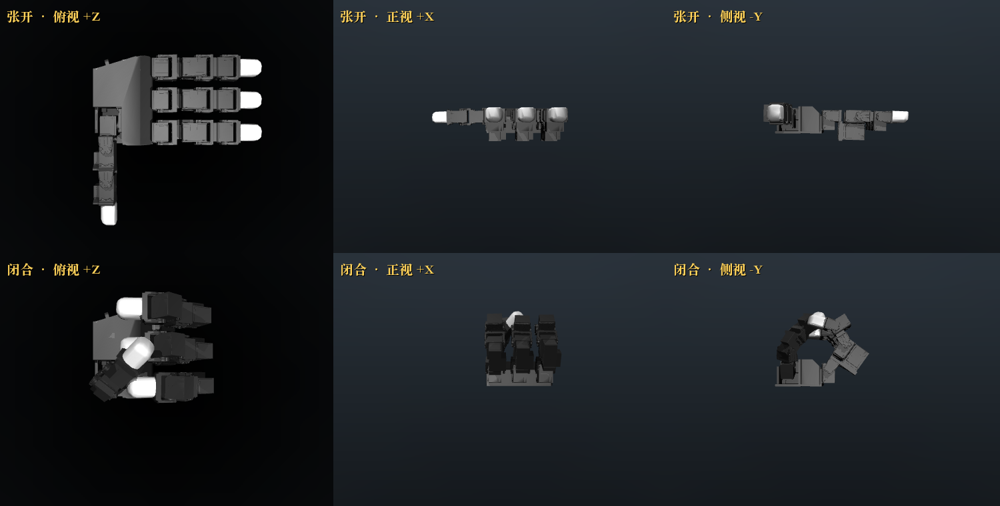
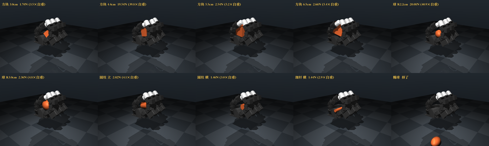

# dexhand-sim · 灵巧手仿真起步

在买任何硬件之前，先用仿真把想法过一遍。

对象是 [**LEAP Hand**](https://leaphand.com/)（CMU 开源，16 自由度，v2 版本 $200）——
目前个人开发者入门灵巧手性价比最高的那只。仿真环境用 MuJoCo 3.11 +
[mujoco_menagerie](https://github.com/google-deepmind/mujoco_menagerie) 官方模型，
M4 MacBook 本地 CPU 就跑得动（空载实时倍率 ~120x），不需要 GPU。

这个仓库不是一个库，是**一组实验和实验结论**。代码是为了得出结论而写的，
所以先读 [`RESULTS.md`](RESULTS.md)，再看代码。



## 几条结论

跑完两轮实验（抓握力学 + 手势/对指）攒下来的，完整版和证据在 [`RESULTS.md`](RESULTS.md)：

- **抓握 = 几何包络 + 法向力，摩擦是二阶项。** 往上拔的方向摩擦完全没用（μ 扫 60 倍，
  抓握强度纹丝不动）；只有沿掌面横推才吃摩擦。跟直觉相反。
- **闭合幅度是主变量**，位形 ×1.0→×1.8，强度从 4× 自重涨到 116×，
  中间有个"从贴着变成包过去"的阈值。
- **落点比什么都敏感**，偏 2cm 就从 40× 掉到 4×。
- **接触点数量和抓得牢基本无关**（r=+0.25），法向力才相关（r=+0.91）。
  "接触点多 = 抓得稳"是错的。
- **系统对毫米级差异是混沌的**：同条件 5 次微扰动，结果 2.9×–39.8×。
  → 任何仿真实验都必须重复 + 报区间；上 RL 时 reward 的方差主要来自物理本身，不是算法。
- **开环下发一组关节角，手到不了那个位置**：残余 ~6°，握拳时 14°。
  把 kp 从 3 加到 120 这个误差**纹丝不动** —— 是手指**自碰撞**顶住的，不是伺服软，
  P 增益压不掉。得用迭代补偿（`cmd += 0.6 × 误差`）把指令抬上去，增益取 1.0 会来回震荡。
  这条直接影响 sim2real 和遥操作轨迹 replay。
- **LEAP 只有 3 指 + 拇指，没有小指**，数不到 5。但拇指对三根手指全部够得到且指尖真接触，
  opposition 完整 —— 这是它值得当第一只手的理由。

两个 MuJoCo 坑：

- ⚠️ **接触对的摩擦取两个 geom 的逐元素最大值**，不是乘积也不是较小值。
  只调物体的 friction，只要低于手的 0.2 / 指尖 0.5 就完全没效果。
- ⚠️ **仿真第一件事永远是查初始穿模**。最初这里写过「28 个接触点，方块未落地 ✋」，
  那是**错的** —— 那版把方块放在了手掌内部，一开始就穿模 6mm，法向力十万 N 级，
  "抓住了"是穿透回弹力顶住的。纠错过程见 `RESULTS.md` 第 0 节。

## 看什么

| | |
|---|---|
|  | **`grasp.py`** — 单次抓取。评分口径是「抓稳后沿掌面法向加力拽，拽走时的力 ÷ 物体自重」，≥1× 才算真抓住。掌心朝上时"没掉"完全不是判据。 |
|  | **`views.py`** — 张开/闭合三视图，用来搞清楚坐标系。 |
|  | **`sweep.py`** — 形状 / 摩擦 / 位形 / 单关节四组批量扫描，~55s。 |

手势动画：[`gestures.mp4`](gestures.mp4)（31s，18 个姿势，带镜头切换）。

## 跑起来

仓库里不含 `.venv/`(105M) 和 `mujoco_menagerie/`(30M)，先建环境：

```bash
git clone https://github.com/jason3535/dexhand-sim.git
cd dexhand-sim
./setup.sh    # 稀疏拉三只手的模型 + 建 venv 装 MuJoCo，几分钟
```

> `setup.sh` 把 menagerie 固定在 `c1a4eeb`。所有实验结论都是在这个版本的模型上跑出来的，
> 换 commit 数字可能对不上。

然后：

```bash
./.venv/bin/python check.py       # 环境自检 + 打印 LEAP Hand 的 16 个关节
./.venv/bin/python grasp.py       # 抓一个方块，出 grasp.png
./.venv/bin/python calibrate.py   # 掌心哪个落点抓得最牢（7×7 热力图，~5s）
./.venv/bin/python sweep.py       # 形状/摩擦/位形/单关节 四组扫描（~55s）
./.venv/bin/python gestures.py    # 18 个手势：拼图 + 31s 动画 + viewer 关键帧（~50s）
./.venv/bin/python gestures.py --sheet   # 只出拼图，调姿势时用（~8s）
```

## 交互式查看器

```bash
./.venv/bin/python -m mujoco.viewer --mjcf=mujoco_menagerie/leap_hand/scene_right.xml
# 带方块的场景（grasp.py 跑完才会生成）：
./.venv/bin/python -m mujoco.viewer --mjcf=mujoco_menagerie/leap_hand/_scene_grasp.xml
# 逐个切手势看（gestures.py 跑完才会生成，18 个关键帧）：
./.venv/bin/python -m mujoco.viewer --mjcf=mujoco_menagerie/leap_hand/_scene_gestures.xml
```

常用键：`空格` 暂停 / `→` 单步 / `Backspace` 复位 / `Tab`、`Shift+Tab` 开关左右面板 /
`C` 显示接触点 / `F` 显示接触力 / `T` 半透明 / `[` `]` 切相机 / `F1` 全部快捷键。

**切手势**：按 `Tab` 打开**左**面板，`Simulation` 一节里找 **`Load key`**
（不叫 "Keyframe"），旁边的数字框选 0–17。视角丢了按 **`Align`** 拉回来。

MacBook 触控板：单指拖=转视角，双指点住拖=平移，双指上下滑=缩放；
双击选中物体后 `Ctrl`+双指拖 = 推它（等价于外接鼠标的 `Ctrl`+右键拖）。

> 别用 `.venv/bin/mjpython`，这个 venv 是 uv 装的、没有 framework 版 libpython，
> mjpython 起不来（`Library not loaded: @rpath/libpython3.12.dylib`）。
> 上面的 `python -m mujoco.viewer` 是好使的。

## 文件

- **[`RESULTS.md`](RESULTS.md) — 实验结论，先读这个**
- `setup.sh` — 从零重建环境
- `sim.py` — **公共仿真层**：搭场景、把物体正确放到掌面上、跑抓取 + 拽拉测试
- `check.py` — 环境自检
- `grasp.py` — 单次抓取演示 → `grasp.png`
- `calibrate.py` — 扫掌心落点 → `calibrate.csv` + 热力图
- `sweep.py` — 四组批量实验 → `results.csv` / `sweep_shapes.png` / `sweep_output.txt`
- `views.py` — 张开/闭合三视图 → `hand_views.png`
- `gestures.py` — 18 个手势（握拳/点赞/剪刀/OK/逐指对指/波浪…）
  → `gestures.png` + `gestures.mp4` + viewer 用的关键帧场景。
  「捏」不是手写角度，是用运动学求解拇指去够每根手指的指尖

`setup.sh` 拉下来的 `mujoco_menagerie/` 里有三只手：

- `leap_hand/` — **LEAP Hand，16 DoF**，本仓库全部实验用的就是它
- `shadow_hand/` — Shadow Hand，24 DoF，工业标杆（真机 $100k+）
- `wonik_allegro/` — Allegro Hand，16 DoF（真机 $15k+）

脚本生成的 `_scene_*.xml` 也落在 `leap_hand/` 里面 —— 因为 mesh 走相对路径，
场景 XML 必须和模型同目录（`from_xml_string` + `<include>` 会让路径失效）。
这个目录不入库，所以新克隆后要先跑一次 `grasp.py` / `gestures.py` 才有对应场景。

## 坐标系（免得再踩坑）

掌面朝 **+z**，高度 **z≈0.129–0.135**；四指从 x≈0 伸向 +x 再往上卷；拇指在 −y 侧横过来。
物体必须放在掌面**上方** —— `sim.rest_height()` 会自动二分算出贴掌面的高度。

关节命名：`if_/mf_/rf_` = 食指/中指/无名指，`th_` = 拇指。
每根手指四个自由度 `mcp`（朝掌心弯）/ `rot`（左右张开）/ `pip` / `dip`（继续卷）。

## 接下来三步

**第 1 步 · 改参数，建立直觉** — ✅ 已完成，见 `RESULTS.md`。
还想继续挖的话：加**扭矩方向**的拽拉测试（真实失败模式多是"转出去"不是"拔出来"），
以及把手自己的 geom friction 一起改，做一次真正的"湿肥皂"实验。

**第 2 步 · 换任务：手内旋转（1–2 周）**
抓取是入门题，真正区分灵巧手和夹爪的是 **in-hand reorientation**（不借助外力，
只靠手指把物体在掌心转到指定朝向）。这是 OpenAI 魔方、LEAP Hand 论文的核心任务。
用脚本做不到 —— 这就是为什么需要 RL。

> 带着第 1 步的结论去做第 2 步会顺很多：既然系统对毫米级差异是混沌的，
> 那 reward 的方差主要来自物理本身，不是算法。实验设计上**从一开始就要多种子 + 报区间**。

**第 3 步 · 上 RL**
装 [`mujoco_playground`](https://github.com/google-deepmind/mujoco_playground)（DeepMind 出的，
自带 `LeapCubeReorient` 环境）或 ManiSkill。

> ⚠️ **这一步 Mac 会卡住**：MJX/JAX 的大规模并行需要 CUDA，M4 上只能跑 CPU 版，慢几十倍。
> 到这一步再租一台 4090 云主机（几块钱一小时），不用现在买。

## 什么时候该买硬件

跑完第 2 步，应该能回答这三个问题。答不上来就先别买：

1. 要解决的问题，**夹爪能不能做**？（能的话就别碰灵巧手）
2. 需要几个自由度？触觉是必需还是加分？
3. 策略是**遥操作示教**还是 **RL**？前者要配数采方案，后者要配 GPU。

答得上来了，第一只手买 [LEAP Hand v2](https://v2.leaphand.com/)（$200）。
